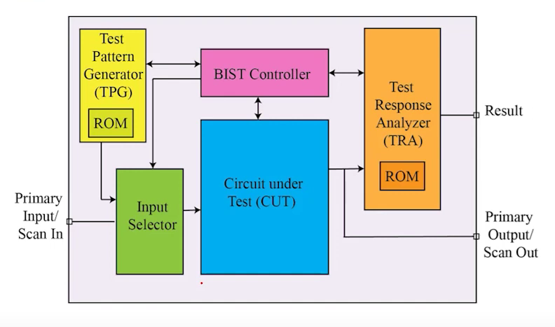

# Built in Self Test (BIST) Design
# Built-In Self-Test (BIST) Design

## What is BIST?
**Built-In Self-Test (BIST)** is a **Design-for-Testability (DfT)** technique that equips digital circuits with the ability to **test themselves**.  
Instead of relying on costly and time-consuming **Automatic Test Equipment (ATE)**, BIST integrates additional hardware into the design to automatically generate test patterns, apply them to the circuit, and analyze the responses.

  

## Purpose of BIST
- To **increase reliability** of digital systems.  
- To **reduce dependency on external test hardware**.  
- To allow **on-chip testing** in the field, ensuring devices can self-verify even after deployment.  
- To make testing **faster, cheaper, and scalable**.  

## Where BIST is Used
BIST is widely applied in:  
- **VLSI circuits & SoCs** – ensuring correctness of large, complex chips.  
- **Memories (MBIST)** – for RAM, ROM, cache testing.  
- **Digital logic blocks** – ALUs, multipliers, controllers, etc.  
- **Communication systems** – to verify data integrity.  
- **Mission-critical systems** – aerospace, automotive, medical devices, where self-checking is essential.  

## How BIST Works?
A typical BIST architecture includes:

1. **Test Pattern Generator (TPG):** 
   - **Generates test inputs:** Produces a sequence of pseudo-random test vectors to stimulate the Circuit Under Test (CUT).
   - **LFSR-based:** Uses a Linear Feedback Shift Register to create deterministic but pseudo-random bit patterns based on a chosen feedback polynomial. (x^4 + x + 1)

2. **Input Selector:**
   - **Switching between inputs:** Chooses whether the CUT receives normal functional inputs (Primary Input/Scan In) or BIST-generated patterns from the TPG.
   - **Test mode control:** Controlled by the BIST Controller to route signals depending on whether the system is in normal mode or test mode.
   - **Isolation:** Ensures functional input signals are isolated during self-test to prevent interference.
     
3. **Circuit Under Test (CUT):**
   - **Target of testing:** This is the hardware block whose functionality is being verified.
   - **Receives test patterns:** Gets inputs from the Input Selector during test mode.
   - **Produces responses:** Outputs from CUT are sent to the Test Response Analyzer for evaluation.

4. **BIST Controller:**
   - **Central control unit:** Orchestrates the entire self-test operation, including pattern generation, response collection, and signature comparison.
   - **Sequencing:** Controls when to start/stop the LFSR and MISR, and when to switch the Input Selector.
   - **Result decision:** Triggers the comparison between the generated signature and stored golden signature, then sets the final pass/fail flag.

5. **Output Response Analyzer (ORA):**
   - **Response compression:** Uses a Multiple Input Signature Register (MISR) to compress CUT’s multiple output bits into a compact signature.
   - **Fault detection:** Final MISR value is compared with the pre-stored golden signature to determine if the CUT is fault-free.

## Advantages of BIST
- **Reduced Cost:** Eliminates need for expensive ATE.  
- **Speed:** Enables faster testing since it runs at system speed.  
- **Autonomy:** Circuit can test itself anytime, even in the field.  
- **Fault Coverage:** High probability of detecting stuck-at and transient faults.  
- **Scalability:** Suitable for complex chips where external testing is impractical.  

## Conclusion
BIST is a **self-test methodology** that adds intelligence to digital circuits, allowing them to validate their own functionality. In this project, the BIST is integrated with a **Circuit Under Test (CUT)**, demonstrating how test patterns are generated, applied, and analyzed to produce a reliable pass/fail status. This approach improves fault detection, reduces testing costs, and ensures robust and trustworthy designs.
